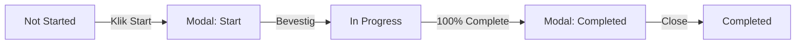

# Research Flow Interactions - Complete Specification

## 📋 Overzicht

Complete documentatie van alle interacties, visuele feedback, microcopy en statusveranderingen bij het starten en voltooien van onderzoek in de Asset Unlock Detail View.

---

## 🎬 Interactieflow

### Flow Diagram
```
┌─────────────────────────────────────────┐
│ 1. ASSET DETAIL VIEW                     │
│    - Toon beschikbare onderzoeken       │
│    - Status: Not Started                │
│    └─> Klik "Start onderzoek"           │
│                                          │
│ ┌─────────────────────────────────────┐ │
│ │ 2. START MODAL                       │ │
│ │    - Preview impact (+35%)           │ │
│ │    - Geschatte tijd                  │ │
│ │    - Wat te verwachten               │ │
│ │    └─> Klik "Start onderzoek"        │ │
│ │                                      │ │
│ │ ┌───────────────────────────────────┐ │
│ │ │ 3. WORKING MODAL                   │ │
│ │ │    - Animated progress (0-100%)    │ │
│ │ │    - Status messages               │ │
│ │ │    - Loading spinner               │ │
│ │ │    └─> Auto-advance bij 100%       │ │
│ │ │                                    │ │
│ │ │ ┌─────────────────────────────────┐ │
│ │ │ │ 4. COMPLETED MODAL              │ │
│ │ │ │    - Success icon ✓             │ │
│ │ │ │    - Confetti animation         │ │
│ │ │ │    - Impact summary (+35%)      │ │
│ │ │ │    - Next steps                 │ │
│ │ │ │    └─> Klik "Bekijk resultaten" │ │
│ │ │ │                                 │ │
│ │ │ │ ┌───────────────────────────────┐│
│ │ │ │ │ 5. ASSET DETAIL VIEW          ││
│ │ │ │ │    - Updated status: Voltooid ││
│ │ │ │ │    - Progress bar updated     ││
│ │ │ │ │    - Toast notification       ││
│ │ │ │ │    - Unlock notification (?)  ││
│ │ │ │ └───────────────────────────────┘│
│ │ │ └─────────────────────────────────┘ │
│ │ └───────────────────────────────────┘ │
│ └─────────────────────────────────────┘ │
└─────────────────────────────────────────┘
```

---

## 📝 Microcopy per Stap

### STAP 1: Asset Detail View (Not Started)

**Method Card - Available State**
```tsx
Titel: "[Method Name]"  
Badge: "FREE" (groen, Minty Green)
       "Basic" (outline met Crown icon)
       "Pro" (premium)
       
Description: "[method.description]"

Metadata:
- "Impact: High/Medium/Low"
- "+35% unlock"
- "⏱ 5 min" / "⏱ 2-4 hours"

CTA Button: "Start onderzoek"
```

**Status Badge (Bovenin)**
```tsx
Geblokkeerd:
- Icon: 🔒 Lock
- Kleur: Rood
- Tekst: "Geblokkeerd"

At Risk:
- Icon: ⚠️ AlertTriangle
- Kleur: Oranje
- Tekst: "Meer onderzoek aanbevolen"

Unlocked:
- Icon: ✓ CheckCircle2
- Kleur: Groen
- Tekst: "Ready to Decide"
```

**Status Message**
```tsx
Geblokkeerd:
"Minimaal onderzoek is vereist om dit asset te ontgrendelen"

At Risk:
"Voer extra onderzoek uit om besluitvorming te versterken"

Unlocked:
"Dit asset heeft voldoende onderzoek om strategische beslissingen te maken"
```

**Progress Indicator**
```tsx
"Onderzoeksvoortgang"
"2 van 4 voltooid"
[Progress Bar: 50%]
```

---

### STAP 2: Start Modal

**Header**
```tsx
Titel: "Start [Method Name]"
Badge: "FREE" / "Basic" icon
Subtitel: "Voor [Asset Name]"
```

**Impact Preview Card**
```tsx
Icon: 📈 TrendingUp
Titel: "Ontgrendel +35% besliskracht"
Beschrijving: "Dit onderzoek vergroot je mogelijkheid om strategische beslissingen te nemen voor [Asset Name]."
```

**Details Grid**
```tsx
Geschatte tijd: "5 min" / "2-4 hours" / "1-2 weeks"
Beslisimpact: "+35%" (Minty Green)
```

**Wat kun je verwachten?**
```tsx
Titel: "Wat kun je verwachten?"

AI Exploration:
✓ "AI-gegenereerde inzichten binnen enkele minuten"
✓ "Strategische aanbevelingen gebaseerd op best practices"
✓ "Geen kosten, direct beschikbaar"

Workshop:
✓ "Interactieve sessie met stakeholders"
✓ "Gefaciliteerde oefeningen en templates"
✓ "Directe consensus en alignment"

Interviews:
✓ "Diepgaande gesprekken met key stakeholders"
✓ "Kwalitatieve inzichten en verhalen"
✓ "Persoonlijke perspectieven en nuance"

Questionnaire:
✓ "Gestructureerde vragenlijst voor breed publiek"
✓ "Kwantitatieve data en statistieken"
✓ "Representatieve resultaten en trends"
```

**CTAs**
```tsx
Secondary: "Annuleren" (Ghost variant)
Primary: "Start onderzoek →" (Minty Green)
```

---

### STAP 3: Working Modal

**Header**
```tsx
Titel: "[Method Name] bezig..."
```

**Status Messages (Dynamic)**
```tsx
0-29%:   "Onderzoek wordt geïnitialiseerd"
30-59%:  "Data wordt verzameld"
60-89%:  "Inzichten worden gegenereerd"
90-100%: "Resultaten worden afgerond"
```

**Progress Indicator**
```tsx
Progress Bar: 0% → 100% (animated)
Progress Text: "45% voltooid"
Impact Counter: "+16% ontgrendeld" (realtime, gebaseerd op progress)
```

**Loading Message**
```tsx
Icon: ⏳ Loader2 (spinning)
Tekst: "Dit kan even duren..."
```

**Visual Feedback**
```tsx
- Method icon: Pulserend/roterend (motion animation)
- Gradient achtergrond: Minty Green → Blue
- Progress bar: Smooth animation, groene fill
```

---

### STAP 4: Completed Modal

**Success Indicator**
```tsx
Icon: ✅ CheckCircle2 (groene cirkel)
Animation: Scale from 0 to 1 (spring effect)
```

**Header**
```tsx
Titel: "Onderzoek voltooid! 🎉"
Subtitel: "[Method Name] is succesvol afgerond voor [Asset Name]"
```

**Impact Card**
```tsx
Background: Groene gradient (green-50 → emerald-50)
Border: Groene border

Icon: 🔓 Unlock
Impact: "+35%" (groot, groen, bold)
Tekst: "Besliskracht vergroot • Asset dichter bij ontgrendeling"
```

**Volgende Stappen**
```tsx
Icon: ✨ Sparkles (Minty Green)
Titel: "Volgende stappen"

Items:
• "Bekijk de onderzoeksresultaten"
• "Voer meer onderzoek uit om het asset verder te ontgrendelen"
• "Start met strategische beslissingen zodra het asset ontgrendeld is"
```

**CTAs**
```tsx
Secondary: "Terug naar overzicht" (Outline)
Primary: "Bekijk resultaten →" (Minty Green)
```

**Special Effects**
```tsx
- Confetti: 200 pieces, 3 seconden
- Fade-in animations: Staggered (0.2s delay per element)
- Success sound (optioneel)
```

---

## 🎨 Statusveranderingen & Visual Feedback

### Status Transitions



### Visual States per Research Method

#### 1. Not Started
```tsx
Card styling:
- Border: Dashed border (border-dashed)
- Background: Transparent
- Hover: border-primary/50, bg-muted/30
- Icon: Muted color
- Badge: FREE/Basic visible
- CTA: "Start onderzoek" button

Impact indicator:
- "+35%" prominent rechtsboven (Minty Green)
```

#### 2. In Progress
```tsx
Card styling:
- Border: Solid blue border
- Background: Blue-50/50
- Icon: Blue background
- Badge: "Bezig" (blauw met Shield icon)
- CTA: "Doorgaan" button (outline)

Note: Currently simulated in modal, not persistent
```

#### 3. Completed
```tsx
Card styling:
- Border: Solid green border
- Background: Green-50/50
- Icon: Green background met CheckCircle2
- Badge: "Voltooid" (groen met CheckCircle2 icon)
- CTA: "Bekijk resultaten" button (outline)

Status text:
"Validated by [Method Name]"
"Research complete • High confidence"
```

---

## 🔔 Notifications & Toasts

### Toast bij Completion
```tsx
Type: Success
Icon: CheckCircle2
Titel: "[Method Name] voltooid!"
Beschrijving: "+35% besliskracht toegevoegd aan [Asset Name]"
Duration: 5000ms
Position: Top-right
```

### Toast bij Full Unlock
```tsx
Type: Success (special)
Icon: 🎉 
Titel: "🎉 Asset ontgrendeld!"
Beschrijving: "[Asset Name] is nu volledig ontgrendeld en klaar voor strategische beslissingen."
Duration: 7000ms
Position: Top-right
Animation: Slide in + bounce
Trigger: Wanneer status verandert van At Risk/Blocked → Safe to Decide
```

### Toast Voorbeelden

**Scenario 1: Eerste onderzoek voltooid**
```
✅ AI Exploration voltooid!
+35% besliskracht toegevoegd aan Golden Circle
```

**Scenario 2: Asset volledig ontgrendeld**
```
🎉 Asset ontgrendeld!
Golden Circle is nu volledig ontgrendeld en klaar voor strategische beslissingen.
```

**Scenario 3: Alle onderzoeken voltooid**
```
🎊 Alle onderzoeken voltooid!
Je hebt 100% besliskracht ontgrendeld voor Golden Circle.
```

---

## 📊 Progress Tracking

### Progress Bar Updates

**Initial State (0/4 onderzoeken)**
```tsx
Progress: 0%
Color: Gray
Label: "0 van 4 voltooid"
```

**After 1st Research (1/4)**
```tsx
Progress: 25%
Color: Minty Green (animate from gray)
Label: "1 van 4 voltooid"
Animation: Smooth fill transition (500ms)
```

**After 2nd Research (2/4)**
```tsx
Progress: 50%
Color: Minty Green
Label: "2 van 4 voltooid"
```

**Fully Completed (4/4)**
```tsx
Progress: 100%
Color: Green (darker shade)
Label: "4 van 4 voltooid"
Glow: Subtle green glow effect
```

### Decision Impact Counter

```tsx
Initial: 0%
After AI Exploration: 35%
After Workshop: 80% (35 + 45)
After Interviews: 120% (capped at 100% display, shows 100%)
After Questionnaire: 145% (capped at 100%)

Display:
"[35]%" - Bold, Minty Green, text-3xl
"Ontgrendeld door 1 onderzoek" - Muted, text-xs
```

---

## 🎭 Animations & Transitions

### Modal Transitions

**Opening**
```tsx
Initial: { opacity: 0, y: 20 }
Animate: { opacity: 1, y: 0 }
Duration: 300ms
Easing: ease-out
```

**Closing**
```tsx
Exit: { opacity: 0, y: -20 }
Duration: 300ms
Easing: ease-in
```

**Step Changes**
```tsx
Mode: "wait" (wait for exit before entering)
Exit current: { opacity: 0, scale: 0.95 }
Enter next: { opacity: 1, scale: 1 }
Duration: 300ms
```

### Progress Animation

**Working State**
```tsx
Icon rotation:
- rotate: [0, 5, -5, 0]
- scale: [1, 1.1, 1]
- duration: 2s
- repeat: Infinity
- easing: ease-in-out

Progress bar:
- Update every 100ms
- Smooth linear transition
- Green fill color
```

### Completion Animations

**Success Icon**
```tsx
Initial: { scale: 0 }
Animate: { scale: 1 }
Transition: { type: "spring", duration: 0.6 }
```

**Content Stagger**
```tsx
Title: delay 0.2s
Description: delay 0.3s
Impact Card: delay 0.4s
Next Steps: delay 0.5s
Buttons: delay 0.6s
```

**Confetti**
```tsx
Pieces: 200
Duration: 3000ms (then auto-stop)
Recycle: false
Colors: Minty Green, Blue, Pink, Orange
Gravity: 0.3
```

**Implementation Note**: Custom confetti component (`CustomConfetti.tsx`) gebruikt Motion voor animaties in plaats van react-confetti package (compatibility issues). Features:
- 50 animated pieces
- Random colors from brand palette
- Random shapes (circles + squares)
- Physics-based falling animation
- Auto-cleanup after 3 seconds

### Card Hover Effects

**Not Started Cards**
```tsx
Hover:
- border-color: primary/50
- background: muted/30
- scale: 1.01 (subtle lift)
- shadow: md → lg
- transition: 200ms ease
```

**Completed Cards**
```tsx
Hover:
- shadow: sm → md
- No scale (already complete)
- Cursor: pointer
- transition: 200ms ease
```

---

## 🎯 Navigation & User Flow

### Entry Points

**1. From Asset Detail View**
```
User Journey:
1. Browse brand assets in "Your Brand"
2. Click on specific asset (e.g., Golden Circle)
3. See research methods with "Start onderzoek" buttons
4. Click button → Open Start Modal
```

**2. From Compact View**
```
User Journey:
1. Switch to Compact layout (toggle button)
2. See 2-column grid of research methods
3. Click entire card → Open Start Modal
```

**3. From "Ontgrendel met onderzoek" CTA**
```
User Journey:
1. See locked status badge
2. Click primary "Ontgrendel met onderzoek" button
3. Scroll to research methods OR open quick picker
```

### Exit Points

**1. Complete Flow**
```
Path: Start → Work → Complete → "Bekijk resultaten"
Result: Navigate to results page (ResearchDashboard)
```

**2. Cancel**
```
Path: Start Modal → "Annuleren"
Result: Close modal, return to Asset Detail View
```

**3. Close Completed**
```
Path: Complete Modal → "Terug naar overzicht"
Result: Close modal, refresh Asset Detail View with updated data
```

---

## 💬 Microcopy Varianten

### Tone of Voice

**Principle**: Direct, Informatief, Motiverend

**Do's**:
✅ "Start onderzoek" (kort, actiegericht)
✅ "+35% besliskracht" (concrete waarde)
✅ "Voltooid" (duidelijke status)
✅ "Dit kan even duren..." (empathisch)

**Don'ts**:
❌ "Onderzoek beginnen" (formeel)
❌ "Verhoog je besluitvormingscapaciteit" (omslachtig)
❌ "Afgerond" (te zakelijk)
❌ "Even geduld" (te vaag)

### Context-Aware Copy

**Free Methods**
```tsx
Badge: "FREE" (Minty Green, prominent)
Description: "Geen kosten, direct beschikbaar"
CTA: "Start gratis onderzoek" (optioneel)
```

**Paid Methods**
```tsx
Badge: "Basic" / "Pro" (outline, met Crown icon)
Description: "Upgrade required"
CTA: "Upgrade & Start" (disabled voor locked)
```

**High Impact Methods**
```tsx
Impact badge: "+45%" (larger, bold)
Label: "High impact" (in metadata)
Description: Emphasize value proposition
```

---

## 🔄 State Management

### Local State (Component Level)

```tsx
const [selectedLayout, setSelectedLayout] = useState<'default' | 'alternative'>('default');
const [selectedMethod, setSelectedMethod] = useState<Method | null>(null);
const [isFlowModalOpen, setIsFlowModalOpen] = useState(false);
const [localAsset, setLocalAsset] = useState(initialAsset);
```

### State Updates on Completion

```tsx
1. Update localAsset.researchMethods:
   - Find method by ID
   - Set status: 'completed'
   - Add completedDate: new Date().toISOString()

2. Recalculate derived state:
   - completedMethods = filter(status === 'completed')
   - totalUnlockPotential = sum(method.unlocksPotential)
   - unlockProgress = (completed / total) * 100
   - decisionStatus = calculateDecisionStatus(asset)

3. Trigger side effects:
   - Show success toast
   - Check for full unlock
   - Show unlock toast (if applicable)
   - Update parent component (onStartResearch callback)
```

### Persistence (Future)

```tsx
// Currently demo-only, in future:
- Save to localStorage
- Sync with backend API
- Update global state (Context/Redux)
- Trigger webhooks for analytics
```

---

## 📱 Responsive Behavior

### Desktop (>= 1024px)
- Full layout met sidebar
- Modal: 600px width
- Cards: Full width in single column

### Tablet (768px - 1023px)
- Compact header
- Modal: 90% width
- Cards: 2-column grid

### Mobile (< 768px)
- Stack all elements
- Modal: Full screen
- Cards: Single column
- Smaller badges and text

---

## ✅ Checklist: Complete User Flow

**Pre-Start**
- [ ] Asset detail page loads
- [ ] Research methods visible met correcte status
- [ ] FREE badges visible op gratis methods
- [ ] Impact indicators (+35%) visible
- [ ] "Start onderzoek" buttons enabled

**Start Flow**
- [ ] Click "Start onderzoek" opent modal
- [ ] Modal toont method details + impact preview
- [ ] "Wat kun je verwachten" sectie visible
- [ ] Primary CTA "Start onderzoek" enabled
- [ ] Click CTA transitions naar Working state

**Working**
- [ ] Progress bar animate van 0% → 100%
- [ ] Status messages update per 30% increment
- [ ] Method icon animate (pulse/rotate)
- [ ] Impact counter realtime (+16% → +35%)
- [ ] Auto-advance bij 100% complete

**Completion**
- [ ] Success icon animate in (spring effect)
- [ ] Confetti effect triggers (3s)
- [ ] Impact summary visible (+35%)
- [ ] "Volgende stappen" sectie visible
- [ ] CTAs enabled ("Terug" / "Bekijk resultaten")
- [ ] Click CTA closes modal

**Post-Completion**
- [ ] Toast notification visible (5s)
- [ ] Asset detail page refreshes
- [ ] Method card status = "Voltooid" (groen)
- [ ] Progress bar updated (+25%)
- [ ] Impact counter updated (+35%)
- [ ] Decision status recalculated
- [ ] Unlock toast triggers (if applicable)

---

## 🎓 Design Principles

### 1. **Progressive Disclosure**
Toon informatie stapsgewijs:
- Eerst: Overview (Asset + methods)
- Dan: Details (Start modal)
- Daarna: Progress (Working)
- Tenslotte: Result (Completed)

### 2. **Immediate Feedback**
Elke actie krijgt directe visuele respons:
- Button hover: Color change
- Click: Modal opening animation
- Progress: Realtime update
- Completion: Success animation + confetti

### 3. **Clear Status Communication**
Altijd duidelijk wat de status is:
- Not Started: Dashed border, "Start" button
- In Progress: Blue background, "Bezig" badge
- Completed: Green background, "Voltooid" badge

### 4. **Motivating Progress**
Toon vooruitgang op multiple niveaus:
- Per method: Status badge
- Per asset: Progress bar (25%, 50%, 75%, 100%)
- Totaal: Decision impact percentage
- Milestone: Unlock notifications

### 5. **Contextual Help**
Geef context zonder te overweldigen:
- Impact preview in Start modal
- "Wat kun je verwachten" bullets
- "Volgende stappen" na completion
- Tooltip hints (future enhancement)

---

**Document Version**: 1.0  
**Last Updated**: January 2026  
**Component**: AssetUnlockDetailView + ResearchFlowModal  
**Status**: ✅ Fully Implemented